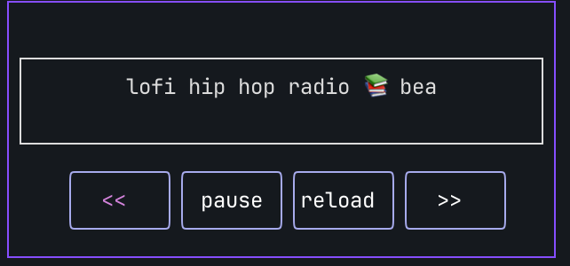

# Lofi-Radio-Player

Making Lofi hiphop Radio an actual radio since 2026



# Usage
```
go build
./lofi-radio
```

## Requirments
- [mpv.io](mpv.io)
- [yt-dlp](https://github.com/yt-dlp/yt-dlp)
    - update frequently to avoid errors with youtube bot detection

## MPV Configuration
Set `MPV_HOME` to your config path to use `mpv.conf` file
```
export MPV_HOME="path/to/mpv_home/
```
Radio will ***not*** auto-detect configuration files at `.mpv/mpv.conf`     
